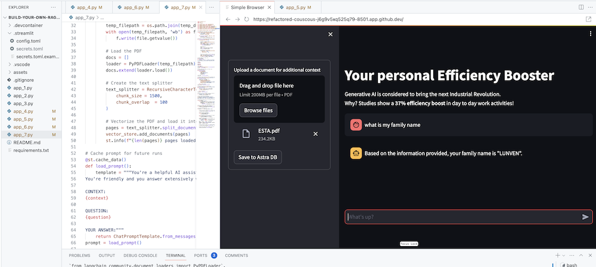

# Build your own RAG Chatbot
Welcome to this workshop to build and deploy your own Enterprise Co-Pilot using Retrieval Augmented Generation with DataStax Enterprise v7, a local inferencer and Mistral, a local and open Large Language Model.

## Safety and security 
This repository focusses on safety and security by keeping your sensitive data within the firewall!

Why?
- First of all it makes use of [Ollama, a local inference engine](https://ollama.com);
- On top of the inference engine, we're running [Mistral, a local and open Large Language Model (LLM)](https://mistral.ai/);
- Also the LLM does not contain any sensitive or enterprise data, as there is no way to secure it in a LLM;
- Instead, your sensitive data is stored securely within the firewall inside [DataStax Enterprise v7 Vector Database](https://www.datastax.com/blog/get-started-with-the-datastax-enterprise-7-0-developer-vector-search-preview);

It leverages [DataStax RAGStack](https://docs.datastax.com/en/ragstack/docs/index.html), which is a curated stack of the best open-source software for easing implementation of the RAG pattern in production-ready applications that use DataStax Enterprise, Astra Vector DB or Apache Cassandra as a vector store.


What you'll learn:
- 🤩 How to leverage [DataStax RAGStack](https://docs.datastax.com/en/ragstack/docs/index.html) for production-ready use of the following components:
    - 🚀 The [DataStax Enterprise v7 Vector Database](https://www.datastax.com/blog/get-started-with-the-datastax-enterprise-7-0-developer-vector-search-preview) for Semantic Similarity search
    - 🦜🔗 [LangChain](https://www.langchain.com) for linking Mistral and DataStax Enterprise
- 🧠 How to use [Ollama](https://ollama.com) as a local inferencing engine
- 🤖 How to use [Mistral](https://mistral.ai/) as a local and open Large Language Model (LLM) for Q&A style chatbots
- 👑 How to use [Streamlit](https://streamlit.io) to easily deploy your awesome app!

- Slides of the presentation can be found [HERE](assets/meetups-slides.pdf)

## 1️⃣ Prerequisites
This workshop assumes you have access to:
1. [A Github account](https://github.com)
2. A development laptop with an IDE (for instance VSCode)
3. [Docker](https://www.docker.com/) on your laptop
4. [Python 3.10+](https://www.python.org/downloads/) on your laptop

In the next steps we'll prepare the repository, DataStax Enterprise, a Jupyter Notebook and the Ollama Inference Engine with Ollama.

### Clone this tutorial to your development laptop
First thing, we'll need to clone this repository to your local development laptop.

1. Open the [build-your-local-ragstack-chatbot](https://github.com/michelderu/build-your-local-ragstack-chatbot) repository
2. Click on `Use this template`->`Ceate new repository` as follows:

    

3. Now select your github account and name the new repository. Ideally also set the description. Click `Create repository`

    

4. Cool! You just created a copy in your own Gihub account!
- Now let's clone it to your local development laptop;
- Open up a fresh termal; 
- `cd` to a sensible directory (like /projects or so);
- `git clone <url-to-your-repo>`
- `cd` to your new directory!

And you're ready to rock and roll! 🥳

### Get a Python environment going
It's useful to create a *Virtual Environment*. Use the below to set it up:
```
python3 -m venv myenv
```
Then activate it as follows:
```
source myenv/bin/activate   # on Linux/Mac
myenv\Scripts\activate.bat  # on Windows
```
Now you can start installing the required packages:
```
pip3 install -r requirements.txt
```

### Get DataStax Enterprise and Jupyter started as a Docker Container
Run DSE 7 in any of these two ways from a fresh terminal window:

`docker-compose up`

This uses the docker-compose.yml file in the root of this repository which will also conveniently start the Jupyter Interpreter.

DataStax will be running on http://localhost:9042 and Jupyter will be accesible by browsing to http://localhost:8888

### Start Ollama with Mistral
There are a multitude of inference engines. You can go for [LM Studio](https://lmstudio.ai/) which has a nice UI. In this notebook, we'll use [Ollama](https://ollama.com/).

1. Get started by [downloading](https://ollama.com/download)
2. Install it to your machine
3. Start the inference engine, while downloading Mistral (~4GB) with the command `ollama run mistral` in a fresh terminal window

In case this all fails, because of RAM limitations, you can opt to use [tinyllama](https://ollama.com/library/tinyllama) as a model.

## 2️⃣ Now try the concepts in a Jupyter Notebook
To kick this workshop off, we'll first try the concepts in the supplied [notebook](jovyan/Build_Your_Own_RAG_Meetup.ipynb). We're assuming you'll run from within a Jupyter Docker Container, in case you're not, please change the host names from `host.docker.internal` to `localhost`.

This notebook shows the steps to take to use the DataStax Enterprise Vector Store as a means to make LLM interactions meaningfull and without hallucinations. The approach taken here is Retrieval Augmented Generation.

You'll learn:

1. About the content in a CNN dataset (we'll use the news article about Daniel Radcliffe in this example)
2. How to interact with the Mistral Chat Model without providing this context
3. How to load this context into DataStax Enterprise Vector Store
4. How to run a semantic similarity search on DataStax Enterprise Vector Store
5. How to use this context with the Mistral Chat Model

Browse to http://localhost:8888 and open the notebook that's available in the root called `Build_Your_Own_RAG_Meetup.ipnb`.

## 3️⃣ Getting started with Streamlit to build an app
In this workshop we'll use Streamlit which is an amazingly simple to use framework to create front-end web applications.

To get started, let's create a *hello world* application as follows:

```python
import streamlit as st

# Draw a title and some markdown
st.markdown("""# Your Enterprise Co-Pilot 🚀
Generative AI is considered to bring the next Industrial Revolution.  
Why? Studies show a **37% efficiency boost** in day to day work activities!

### Security and safety
This Chatbot is safe to work with sensitive data. Why?
- First of all it makes use of [Ollama, a local inference engine](https://ollama.com);
- On top of the inference engine, we're running [Mistral, a local and open Large Language Model (LLM)](https://mistral.ai/);
- Also the LLM does not contain any sensitive or enterprise data, as there is no way to secure it in a LLM;
- Instead, your sensitive data is stored securely within the firewall inside [DataStax Enterprise v7 Vector Database](https://www.datastax.com/blog/get-started-with-the-datastax-enterprise-7-0-developer-vector-search-preview);
- And lastly, the chains are built on [RAGStack](https://www.datastax.com/products/ragstack), an enterprise version of Langchain and LLamaIndex, supported by [DataStax](https://www.datastax.com/).""")
st.divider()
```
The first step is to import the streamlit package. Then we call `st.markdown` to write a title and lastly we write some content to the web page.

To get this application started locally you'll need to install the streamlit dependency as follows (which should already be done as part of the prerequisites):
```bash
pip install streamlit
```

Now run the app:
```bash
streamlit run app_1.py
```

This will start the application server and will bring you to the web page you just created.

Simple, isn't it? 🤩

## 5️⃣ Add a Chatbot interface to the app

In this step we'll start preparing the app to allow for chatbot interaction with a user. We'll use the following Streamlit components:
1. 
2. `st.chat_input` in order for a user to allow to enter a question
2. `st.chat_message('human')` to draw the user's input
3. `st.chat_message('assistant')` to draw the chatbot's response

This results in the following code:

```python
# Draw the chat input box
if question := st.chat_input("What's up?"):
    
    # Draw the user's question
    with st.chat_message('human'):
        st.markdown(question)

    # Generate the answer
    answer = f"""You asked: {question}"""

    # Draw the bot's answer
    with st.chat_message('assistant'):
        st.markdown(answer)
```

Try it out using [app_2.py](./app_2.py) and kick it off as follows.  
If your previous app is still running, just kill it by pressing `ctrl-c` on beforehand.

```bash
streamlit run app_2.py
```

Now type a question, and type another one again. You'll see that only the last question is kept.

Why???

This is because Streamlit will redraw the whole screen again and again based on the latest input. As we're not remembering the questions, only the last on is show.

## 6️⃣ Remember the chatbot interaction

In this step we'll make sure to keep track of the questions and answers so that with every redraw the history is shown.

To do this we'll take the next steps:
1. Add the question in a `st.session_state` called `messages`
2. Add the answer in a `st.session_state` called `messages`
3. When the app redraws, print out the history using a loop like `for message in st.session_state.messages`

This approach works because the `session_state` is stateful across Streamlit runs.

Check out the complete code in [app_3.py](./app_3.py). 

As you'll see we use a dictionary to store both the `role` (which can be either the Human or the AI) and the `question` or `answer`. Keeping track of the role is important as it will draw the right picture in the browser.

Run it with:
```bash
streamlit run app_3.py
```

Now add multiple questions and you'll see these are redraw to the screen every time Streamlit reruns. 👍

## 7️⃣ Now for the cool part! Let's integrate with the Mistral Chat Model 🤖

Here we'll link back to the work we did using the Jupyter Notebook and integrate the question with a call to the Mistral Chat Model.

Remember that Streamlit reruns the code everytime a user interacts? Because of this we'll make use of data and resource caching in Streamlit so that a connection is only set-up once. We'll use `@st.cache_data()` and `@st.cache_resource()` to define caching. `cache_data` is typically used for data structures. `cache_resource` is mostly used for resources like databases.

This results in the following code to set up the Prompt and Chat Model:

```python
# Cache prompt for future runs
@st.cache_data()
def load_prompt():
    template = """You're a helpful AI assistent tasked to answer the user's questions.
You're friendly and you answer extensively with multiple sentences. You prefer to use bulletpoints to summarize.

QUESTION:
{question}

YOUR ANSWER:"""
    return ChatPromptTemplate.from_messages([("system", template)])
prompt = load_prompt()

# Cache Mistral Chat Model for future runs
@st.cache_resource()
def load_chat_model():
    # parameters for ollama see: https://api.python.langchain.com/en/latest/chat_models/langchain_community.chat_models.ollama.ChatOllama.html
    # num_ctx is the context window size
    return ChatOllama(
        model="mistral:latest", 
        num_ctx=18192, 
        base_url=st.secrets['OLLAMA_ENDPOINT']
    )
chat_model = load_chat_model()
```

Instead of the static answer we used in the previous examples, we'll now switch to calling the Chain:

```python
# Generate the answer by calling Mistral's Chat Model
inputs = RunnableMap({
    'question': lambda x: x['question']
})
chain = inputs | prompt | chat_model
response = chain.invoke({'question': question})
answer = response.content
```
Check out the complete code in [app_4.py](./app_4.py).

Before we continue, we have to provide the `OLLAMA_ENDPOINT` in `./streamlit/secrets.toml`. There is an example provided in `secrets.toml.example`:

```toml
# Ollama/Mistral Endpoint
OLLAMA_ENDPOINT = "http://localhost:11434"
```

To get this application started locally you'll need to install RAGStack which contains a stable version of LangChain and all dependencies (which should already be done as part of the prerequisites):
```bash
pip install ragstack
```

Now run the app:
```bash
streamlit run app_4.py
```

You can now start your questions-and-answer interaction with the Chatbot. Of course, as there is no integration with the DataStax Enterprise Vector Store, there will not be contextualized answers. As there is no streaming built-in yet, please give the agent a bit of time to come up with the complete answer at once.

Let's start with the question:

    What does Daniel Radcliffe get when he turns 18?

As you will see, you'll receive a very generic answer without the information that is available in the CNN data.

## 8️⃣ Combine with the DataStax Enterprise Vector Store for additional context

Now things become really interesting! In this step we'll integrate the DataStax Enterprise Vector Store in order to provide context in real-time for the Chat Model. Steps taken to implement Retrieval Augmented Generation:
1. User asks a question
2. A semantic similarity search is run on the DataStax Enterprise Vector Store
3. The retrieved context is provided to the Prompt for the Chat Model
4. The Chat Model comes back with an answer, taking into account the retrieved context

We will reuse the CNN data we inserted thanks to the notebook.

In order to enable this, we first have to set up a connection to the DataStax Enterprise Vector Store:

```python
# Cache the DataStax Enterprise Vector Store for future runs
@st.cache_resource(show_spinner='Connecting to Datastax Enterprise v7 with Vector Support')
def load_vector_store():
    # Connect to DSE
    cluster = Cluster(
        [st.secrets['DSE_ENDPOINT']]
    )
    session = cluster.connect()

    # Connect to the Vector Store
    vector_store = Cassandra(
        session=session,
        embedding=HuggingFaceEmbeddings(),
        keyspace=st.secrets['DSE_KEYSPACE'],
        table_name=st.secrets['DSE_TABLE']
    )
    return vector_store
vector_store = load_vector_store()

# Cache the Retriever for future runs
@st.cache_resource(show_spinner='Getting retriever')
def load_retriever():
    # Get the retriever for the Chat Model
    retriever = vector_store.as_retriever(
        search_kwargs={"k": 5}
    )
    return retriever
retriever = load_retriever()
```

The only other thing we need to do is alter the Chain to include a call to the Vector Store:

```python
# Generate the answer by calling Mistral's Chat Model
inputs = RunnableMap({
    'context': lambda x: retriever.get_relevant_documents(x['question']),
    'question': lambda x: x['question']
})
```

Check out the complete code in [app_5.py](./app_5.py).

Before we continue, we have to provide the `DSE_ENDPOINT`, `DSE_KEYSPACE` and `DSE_TABLE` in `./streamlit/secrets.toml`. There is an example provided in `secrets.toml.example`:

```toml
# DataStax Enterprise Endpoint
DSE_ENDPOINT = "localhost"
DSE_KEYSPACE = "default_keyspace"
DSE_TABLE = "dse_vector_table"
```

And run the app:
```bash
streamlit run app_5.py
```

Let's again ask the question:

    What does Daniel Radcliffe get when he turns 18?

As you will see, now you'll receive a very contextual answer as the Vector Store provides relevant CNN data to the Chat Model.

## 9️⃣ Let's make this a streaming app

How cool would it be to see the answer appear on the screen as it is generated! Well, that's easy.

First of all, we'll create a Streaming Call Back Handler that is called on every new token generation as follows:

```python
# Streaming call back handler for responses
class StreamHandler(BaseCallbackHandler):
    def __init__(self, container, initial_text=""):
        self.container = container
        self.text = initial_text

    def on_llm_new_token(self, token: str, **kwargs):
        self.text += token
        self.container.markdown(self.text + "▌")
```

Then we explain the Chat Model to make user of the StreamHandler:

```python
response = chain.invoke({'question': question}, config={'callbacks': [StreamHandler(response_placeholder)]})
```

The `response_placeholer` in the code above defines the place where the tokens need to be written. We can create that space by callint `st.empty()` as follows:

```python
# UI placeholder to start filling with agent response
with st.chat_message('assistant'):
    response_placeholder = st.empty()
```

Check out the complete code in [app_6.py](./app_6.py).

And run the app:
```bash
streamlit run app_6.py
```

Now you'll see that the response will be written in real-time to the browser window.

## 1️⃣0️⃣ Now let's make magic happen! 🦄

The ultimate goal of course is to add your own company's context to the agent. In order to do this, we'll add an upload box that allows you to upload PDF files which will then be used to provide a meaningfull and contextual response!

First we need an upload form which is simple to create with Streamlit:

```python
# Include the upload form for new data to be Vectorized
with st.sidebar:
    with st.form('upload'):
        uploaded_file = st.file_uploader('Upload a document for additional context', type=['pdf'])
        submitted = st.form_submit_button('Save to DataStax Enterprise')
        if submitted:
            vectorize_text(uploaded_file)
```

Now we need a function to load the PDF and ingest it into DataStax Enterprise while vectorizing the content.

```python
# Function for Vectorizing uploaded data into DataStax Enterprise
def vectorize_text(uploaded_file, vector_store):
    if uploaded_file is not None:
        
        # Write to temporary file
        temp_dir = tempfile.TemporaryDirectory()
        file = uploaded_file
        temp_filepath = os.path.join(temp_dir.name, file.name)
        with open(temp_filepath, 'wb') as f:
            f.write(file.getvalue())

        # Load the PDF
        docs = []
        loader = PyPDFLoader(temp_filepath)
        docs.extend(loader.load())

        # Create the text splitter
        text_splitter = RecursiveCharacterTextSplitter(
            chunk_size = 1500,
            chunk_overlap  = 100
        )

        # Vectorize the PDF and load it into the DataStax Enterprise Vector Store
        pages = text_splitter.split_documents(docs)
        vector_store.add_documents(pages)  
        st.info(f"{len(pages)} pages loaded.")
```

Check out the complete code in [app_7.py](./app_7.py).

To get this application started locally you'll need to install the PyPDF dependency as follows (which should already be done as part of the prerequisites):
```bash
pip install pypdf
```

And run the app:
```bash
streamlit run app_7.py
```

Now upload a PDF document (the more the merrier) that is relevant to you and start asking questions about it. You'll see that the answers will be relevant, meaningful and contextual! 🥳 See the magic happen!

